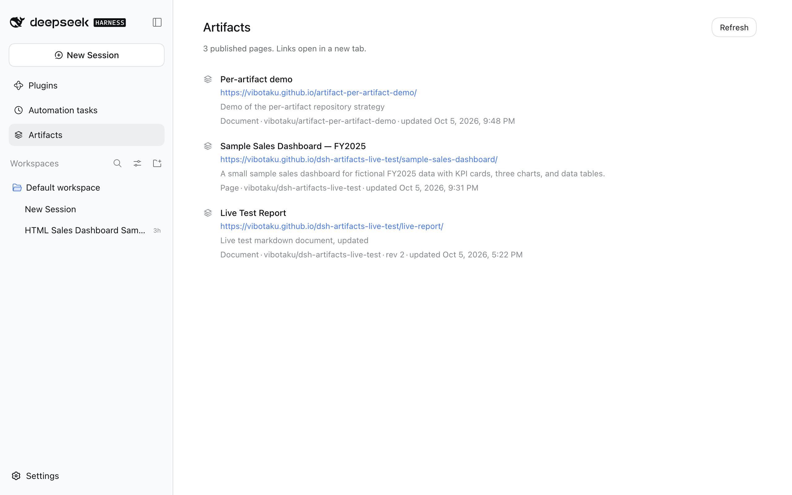
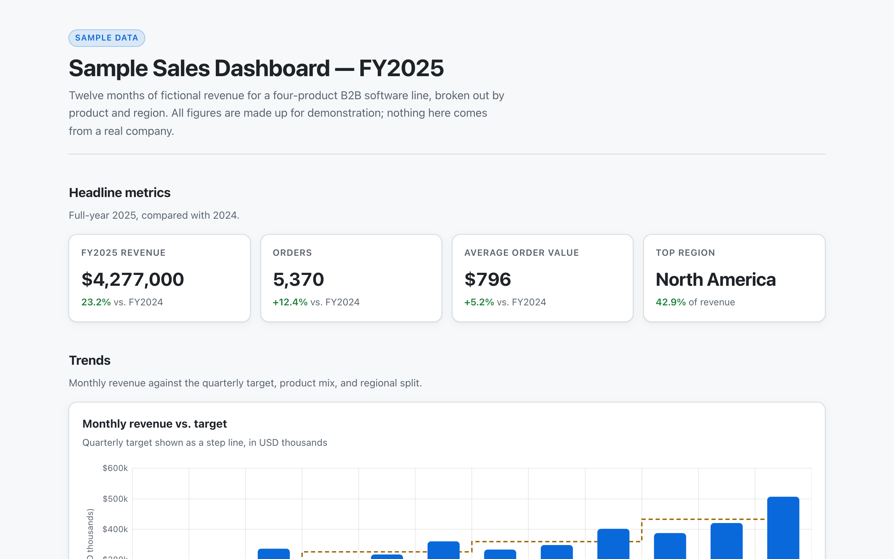
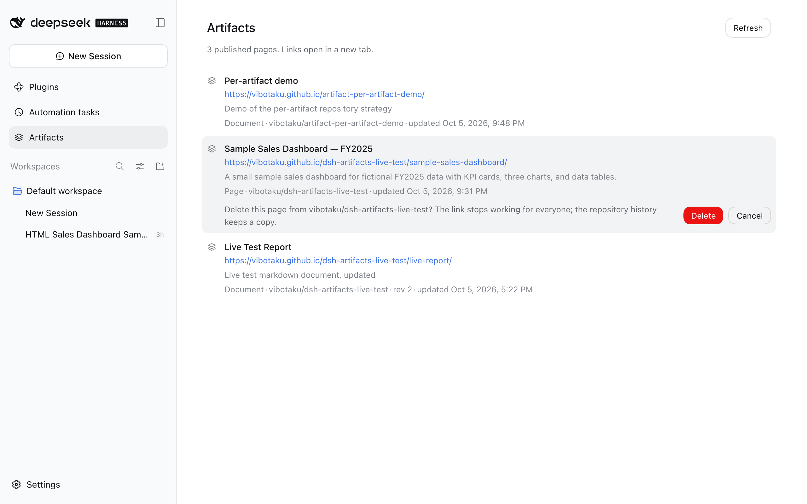
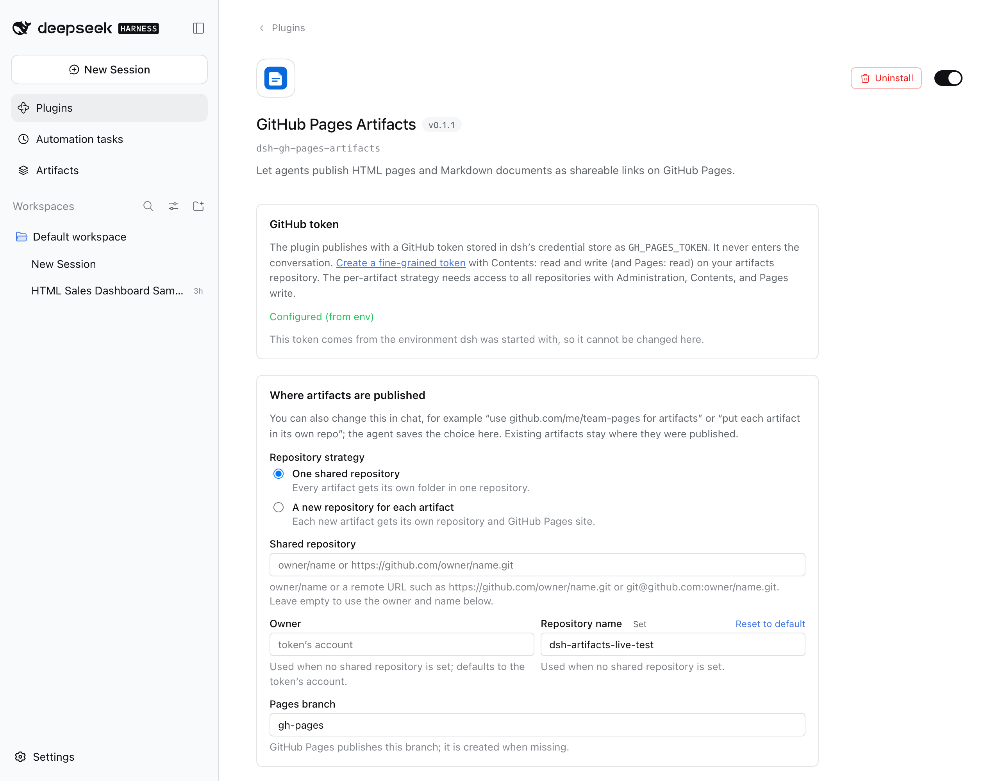

# dsh-gh-pages-artifacts

English | [中文](README.zh.md)

A [DeepSeek Harness](https://github.com/deepseek-ai/deepseek-harness) (dsh) plugin that lets agents publish **artifacts** (HTML pages and Markdown documents) as shareable links on **GitHub Pages**.

Ask the agent for a report, dashboard, chart, or write-up "as a page". It writes the file, publishes it, and replies with a link like `https://you.github.io/dsh-artifacts/q3-report-k3x9ab/`. Later it can update the same artifact in place, so the link never changes. It can also list, read back, and delete artifacts.

<picture>
  <source media="(prefers-color-scheme: dark)" srcset="docs/images/artifacts-panel-dark.png">
  
</picture>

> **Published artifacts are public.** GitHub Pages sites are reachable by anyone with the link. On GitHub Free the repository must be public too, and git history keeps old versions even after deletion. The plugin asks before publishing or deleting (except in *Full access* sessions, see [Behaviour details](#behaviour-details)), adds `noindex`, and refuses hidden files and content that looks like a credential, but you decide what gets shared.

## What it looks like

Each artifact is an ordinary page on GitHub Pages. The agent wrote and published this dashboard itself:

<picture>
  <source media="(prefers-color-scheme: dark)" srcset="docs/images/published-page-dark.png">
  
</picture>

Deleting from the Artifacts panel asks for confirmation in the row itself:

<picture>
  <source media="(prefers-color-scheme: dark)" srcset="docs/images/artifacts-delete-dark.png">
  
</picture>

The plugin's own page under **Plugins** holds its settings:

<picture>
  <source media="(prefers-color-scheme: dark)" srcset="docs/images/settings-dark.png">
  
</picture>

## What the agent gets

| Tool | What it does | Approval |
|---|---|---|
| `artifact_publish` | Create an artifact from a workspace file (`path`) or inline `content`, or update one in place (`id`). Markdown is rendered to a clean page with light and dark themes; HTML is served as-is. Extra files (images, CSS, JS, data) go in `assets`. | yes |
| `artifact_list` | List artifacts, newest first, with ids, titles, URLs; filter with `query`. | no |
| `artifact_read` | Read an artifact's source (or another text file of it) in windows. | no |
| `artifact_delete` | Delete an artifact. Its id is never reused, so an old link can't show new content. | yes |
| `artifact_status` | Diagnose the setup (token, repository, Pages settings) and check whether a deployment or artifact is live. | no |
| `artifact_repository` | Show or change where new artifacts go: link an existing repository (`owner/name` or a remote URL), unlink it, or switch between the shared and per-artifact strategies. | no |

The plugin also adds:

- a short system-prompt section so the model knows when to use the tools, and
- a bundled `artifact-pages` skill with page-design guidance. Users can invoke it as `/artifact-pages`, and a same-named skill in `~/.dsh/skills` or the project overrides it.

## Repository strategies

- **`shared`** (default): every artifact gets a folder in one repository, at `https://<owner>.github.io/<repo>/<id>/`. The repository is, in order: one you **linked** at runtime (*"publish my artifacts to github.com/me/team-pages"*, which the agent does with `artifact_repository` `link`), the `repository` option (`owner/name` or a remote URL such as `git@github.com:me/team-pages.git`), or `owner`/`repo`.
- **`per-artifact`**: each new artifact gets a **new repository** of its own, `<owner>/<repoPrefix><id>` (default `artifact-<id>`), served at `https://<owner>.github.io/artifact-<id>/`. The plugin creates the repository, publishes the page at its root, turns on GitHub Pages, tags it with the `dsh-artifact` topic, and sets the page URL as the repository's homepage. This needs a token that may create repositories (see the token section).

Set it on the plugin's settings page, with the `repoStrategy` option, or in chat (*"from now on, put each artifact in its own repo"*). A choice made in chat is saved into the same settings, so the settings page and your profile file always show what is in effect. (Without dsh's settings service, for example in a custom composition, the choice is kept in the registry instead and overrides the configuration.) Existing artifacts always stay where they were published; updates, reads, and deletes find them through the registry.

## Tracking what was published

Click **Artifacts** in the dsh sidebar (Web and Desktop) to see every published page and document, newest first. Each entry shows its title, link, description, repository, and last update. Links open in a new browser tab (on Desktop, in your default browser). **Refresh** also checks GitHub for artifacts published from another machine. To delete one, hover its row, click the trash icon, and confirm. The plugin commits the removal of its files from the repository and tombstones its id, and the page returns 404 once GitHub Pages redeploys (usually within a minute). Because you confirmed in the panel yourself, the agent approval prompt does not apply here.

Every publish, update, and delete is recorded in a local registry at `$DSH_HOME/gh-pages-artifacts/registry.json` (option `registryDir`). Next to it, `index.html` lists every artifact with **clickable links** to its page and repository, its kind, revision, last update, and whether it is live or deleted. `artifact_list` returns the same list as Markdown links, across all repositories and strategies, and adds artifacts it finds in the shared repository that were published from another machine. Ask *"what have you published?"* or *"show me the artifact index"* (the agent can present the index page in the side panel).

## How it works

- **The repository holds the content.** Each artifact lives in its own folder on the Pages branch (or at the root of its own repository with the per-artifact strategy) (`<id>/index.html`, plus `source.md` for Markdown and any assets). A manifest `.dsh-artifacts.json` at the branch root records ids, titles, descriptions, kinds, revisions, and timestamps. With `siteDir: ''` (the default) the manifest is served too, so anyone who knows the site URL can list every artifact. Publish from `/docs` (`siteDir: docs`) to keep it unlisted.
- **Every change is one atomic commit.** The commit is built with the Git Data API (blobs → tree → commit) and applied with a fast-forward-only ref update. If another writer (a second dsh window, another machine) moved the branch, the change is rebuilt on the new head and retried. Nothing is lost, and nothing is force-pushed.
- **`.nojekyll`** is committed so Pages serves files exactly as written. The plugin refuses to write into an existing Jekyll site (one with `_config.yml` and no `.nojekyll`), and it cannot publish to a protected branch.
- **URLs** are `<site>/<pathPrefix>/<id>/`. The site URL comes from the Pages API, which handles custom domains; set `baseUrl` to override it. Ids are a slug of the title plus a random suffix (`q3-report-k3x9ab`), or a `slug` you choose.
- **Pages caching:** a change is usually live within a minute. Browsers may keep the previous version for up to 10 minutes.

## Requirements

- DeepSeek Harness **0.2.0-rc.2 or newer, within 0.2.x** (Web, Desktop, or CLI).
- A GitHub account and a repository with GitHub Pages enabled (the setup command below does this for you).
- A GitHub token with **Contents: read and write** (and preferably **Pages: read-only**) on that repository only. The per-artifact strategy needs a token that may create repositories instead (see below).

## Setup

### 1. Create the repository and enable Pages

Run this yourself in a terminal (not through the agent), from a checkout of this repository, with the [GitHub CLI](https://cli.github.com) logged in (`gh auth login`):

```bash
node bin/setup.mjs setup --author "Your Name <you@example.com>"
```

It creates a **public** repository `dsh-artifacts` under your account (asking first), creates the `gh-pages` branch, and enables GitHub Pages from it. `--author` sets the author of the commits it makes; without it GitHub uses your account's identity. Other options: `--owner <org>`, `--repo <name>`, `--branch <name>`, `--docs` (publish from `/docs`), `--private` (paid plans only; implies `--docs`; the pages are still public), and `--yes`. Once the package is published to npm, `npx dsh-gh-pages-artifacts setup` does the same.

To do it by hand instead:

1. Create a repository, for example `dsh-artifacts`. Do **not** use your `<you>.github.io` site repository, because artifacts would share its root.
2. In **Settings → Pages**, choose **Deploy from a branch**, then branch `gh-pages` and folder `/ (root)`. If the branch does not exist yet, the plugin creates it on first publish; pushing a `gh-pages` branch usually enables Pages automatically.

### 2. Create a token

Create a [fine-grained personal access token](https://github.com/settings/personal-access-tokens/new):

- **Repository access:** Only select repositories → your artifacts repository
- **Permissions:**
  - **Contents:** Read and write (required)
  - **Pages:** Read-only (recommended; lets `artifact_status` verify the Pages settings and deployments, and lets the plugin discover custom domains)

A classic token with the `public_repo` scope also works but grants far more access. Avoid reusing `gh auth token`: it carries all of your CLI's scopes.

For the **per-artifact** strategy the token must create repositories and turn on Pages: a fine-grained token with **Repository access: All repositories** and **Administration**, **Contents**, and **Pages** set to *Read and write*, or a classic token with `public_repo` (or `repo` for private repositories).

### 3. Give the token to dsh

The plugin reads the credential named by `tokenEnv` (default **`GH_PAGES_TOKEN`**). It never takes the token from the conversation. **Never paste it into a chat.** Use any one of these sources (highest precedence first):

1. **Environment** of the process that launches dsh: `export GH_PAGES_TOKEN=github_pat_...`. Desktop on macOS and Linux imports your login shell's exports at start, so restart the app after changing them.
2. **`$DSH_HOME/.credentials.yaml`** (default `~/.dsh/.credentials.yaml`). It hot-reloads and must be `chmod 600`:

   ```yaml
   version: 1
   refs:
     GH_PAGES_TOKEN: github_pat_...
   ```

   If the file already exists, add the key under its existing `refs:`. Don't add a second `refs:`.
3. A `.env` in the directory you launched dsh from. It is read once at launch, so restart after editing it. If the token comes from here, the plugin requires the `owner` option, so a repository's own `.env` can't silently redirect your publishes to someone else's account.
4. `$DSH_HOME/.env`. Also read at launch, so restart after editing it.

A value from the environment wins and is read-only. Token-shaped variable names (containing `TOKEN`) are scrubbed from the agent's shell commands. The agent's processes run as your OS user, though, so treat this as discretion, not a security boundary.

### 4. Install the plugin

**From the latest release** (recommended; prebuilt, so nothing is built on your machine):

```bash
dsh plugin --profile web add https://github.com/opdsh/dsh-gh-pages-artifacts/releases/latest/download/dsh-gh-pages-artifacts.tgz
```

On **Desktop / Web**, open **Plugins → Add plugin** and enter the same URL. Restart running CLI profiles after installing.

**From source on GitHub.** The package builds itself on install, so pnpm blocks the first attempt until you allow that build:

```bash
dsh plugin --profile web add github:opdsh/dsh-gh-pages-artifacts
```

dsh then prints a key like `dsh-gh-pages-artifacts@https://codeload.github.com/opdsh/dsh-gh-pages-artifacts/tar.gz/<commit>`. Add it with `: true` under `allowBuilds:` in the profile's `pnpm-workspace.yaml` (dsh prints the path), then run the command again. The key names one commit, so allow it again after updating.

**From a local checkout.** Build it first (`lib/` is not committed):

```bash
git clone https://github.com/opdsh/dsh-gh-pages-artifacts.git
```

```bash
cd dsh-gh-pages-artifacts && pnpm install && pnpm run build
```

```bash
dsh plugin --profile web add "$PWD"
```

### 5. Configure it (optional)

Open **Plugins → GitHub Pages Artifacts**. The plugin's page has its settings:

- **GitHub token:** whether one is configured, and a field that saves it to dsh's credential store (not available when the token comes from the environment)
- **Where artifacts are published:** the strategy, the shared repository (`owner/name` or a remote URL), the owner, prefix, and visibility of new repositories, and the Pages branch
- **Commits:** the author name and email
- **Safety:** approval, `noindex`, and secret blocking

Changes apply to the next publish without a restart, and are saved to your profile's `cordis.patch.yml`.

You can also edit that file directly. The defaults work when the repository is `dsh-artifacts` under the token's user and Pages publishes `gh-pages` from the root; otherwise add a row like this:

- CLI: `~/.dsh/profiles/<profile>/cordis.patch.yml`
- Desktop: **Settings → Open configuration file**

```yaml
- id: gh-pages-artifacts
  config:
    owner: your-login-or-org
    repo: dsh-artifacts
```

A patch replaces the row's whole `config`, and any key you leave out uses its default. Check the composed result with `dsh --profile web --dump-config`. Changes reload live in the Web and Desktop apps.

Then ask the agent: *"Make a one-page summary of this repo's architecture and publish it."* If anything is off, ask it to run `artifact_status`.

## Configuration reference

| Option | Default | Meaning |
|---|---|---|
| `owner` | token's user | User or organization that owns the repository. |
| `repo` | `dsh-artifacts` | Repository that hosts artifacts. |
| `repository` | none | The shared repository as `owner/name` or a remote URL (`https://github.com/owner/name.git`, `git@github.com:owner/name.git`); overrides `owner`/`repo` for it. A repository linked at runtime overrides this. |
| `repoStrategy` | `shared` | `shared` (one repository) or `per-artifact` (a new repository for each new artifact). A runtime choice overrides this. |
| `repoPrefix` | `artifact-` | Name prefix of repositories the per-artifact strategy creates. |
| `repoVisibility` | `public` | Visibility of repositories the per-artifact strategy creates. Pages on private repositories needs a paid plan; the pages are public either way. |
| `registryDir` | `$DSH_HOME/gh-pages-artifacts` | Folder for the local registry and its `index.html`. |
| `branch` | `gh-pages` | Branch Pages publishes from. Created on first publish when missing. |
| `siteDir` | `''` | Pages source folder: `''` (root) or `docs`. |
| `pathPrefix` | `''` | Folder under the site root for artifacts, e.g. `a` → `<site>/a/<id>/`. |
| `baseUrl` | from the Pages API | Public site URL. Set it for custom domains when the token lacks Pages read, and on GitHub Enterprise Server (required there unless the token can read Pages). |
| `tokenEnv` | `GH_PAGES_TOKEN` | Credential reference (environment variable name) holding the token. |
| `apiBaseUrl` | `https://api.github.com` | REST API base; change it only for GitHub Enterprise Server. |
| `approval` | `unless-full-access` | `unless-full-access`: ask before publish and delete, except in *Full access* sessions (danger-full-access sandbox with approval prompts turned off). `always`: always ask. `off`: never ask. |
| `hideFromPresets` | `['minimal']` | Agent modes that don't get the artifact tools. |
| `subagentAccess` | `read-only` | Delegated subagents: `read-only` (list, read, status), `full`, or `none`. |
| `noindex` | `true` | Add `<meta name="robots" content="noindex, nofollow">` to pages, even if the page asks to be indexed. |
| `csp` | `object-src 'none'; base-uri 'none'` | Content-Security-Policy meta tag added to pages; `''` disables it. |
| `blockSecrets` | `true` | Refuse hidden and credential files (`.env`, keys, `.ssh/`, ...) and any title, description, page, or asset that looks like a credential (GitHub/AWS/Slack/npm/API keys, JWTs, private keys, passwords in URLs or assignments, the configured token in any common encoding). |
| `maxPublishBytes` | `10485760` | Maximum total bytes of one publish (page plus assets). |
| `commitAuthor` | token's user | `{ name, email }` used as commit author and committer. |
| `promptGuidance` | `true` | Add the short system-prompt section. |
| `bundledSkill` | `true` | Register the `artifact-pages` skill. |

## Behaviour details

- **Approval.** Publish, update, and delete ask through the dsh approval panel. The prompt leads with the exact URL and lists the source file (or inline content size), every asset as `source → published name`, removed assets, and the total size. Titles are quoted and may not contain control or bidi characters, so they can't disguise the request. With the default `unless-full-access`, only *Full access* sessions publish without a prompt; *Auto review* sessions are still asked. Headless runs and SDK sessions without an approval channel fail closed unless you set `approval: off`. Subagents cannot ask for approval, so by default they only get the read-only tools; this is enforced when the tools run, not just by hiding them.
- **Workspace confinement.** `path` and `assets` must be regular files inside the session's working directory. Symlinks, directories, paths that resolve outside it, hidden files, and credential-looking files are refused. The page itself must be `.html`, `.htm`, `.md`, `.markdown`, or `.txt`. This blocks path tricks, but it cannot stop an agent from copying data into the workspace or passing it inline. The approval prompt, and you, remain the real control.
- **Markdown** is rendered with GitHub-flavored Markdown (tables, task lists, footnotes, strikethrough, autolinks). Raw HTML inside Markdown is escaped and `javascript:` links are dropped. Publish HTML for anything interactive.
- **HTML** is published as written. A fragment is wrapped into a complete document. The plugin inserts only the robots and CSP meta tags right after `<head>`, marked with `data-dsh-artifacts` so `artifact_read` returns the page without them. Inline `content` counts as HTML only when it is a whole document (`<!doctype html>` or `<html>`); anything else is rendered as Markdown.
- **Updates** replace the page, keep assets you don't mention, and remove those listed in `removeAssets`. Pass `baseRev` to refuse an update when someone else changed the artifact since you read it.
- **Delete** removes the files from the branch head and tombstones the id. The content stays in git history, and anyone who saved a copy keeps it.
- **Status.** `artifact_status` compares the latest Pages build with the branch head, so "deployed" means your newest change is live. With `wait: true` it waits up to five minutes. Real deployments usually take one to three minutes.
- **Origin isolation.** All project sites of one owner share the `https://<owner>.github.io` origin (cookies, localStorage). If you run other apps on that origin, consider a separate account or organization, or a custom domain, for artifacts.

## Development

Releases are cut by pushing a tag that matches `package.json` (for example `v0.1.0`); the release workflow tests, builds, and attaches `dsh-gh-pages-artifacts.tgz` to the GitHub Release.

```bash
pnpm install
pnpm run typecheck
pnpm test          # unit, integration (real dsh tool/approval/fs/skill services), and setup-script tests against an in-memory GitHub
pnpm run build     # emits lib/
```

To try a local checkout without installing it, run dsh with an overlay patch:

```yaml
# dev.patch.yml
- insert:
    - id: gh-pages-artifacts
      name: /absolute/path/to/gh-pages-plugin/lib/index.js
      config:
        owner: your-login
```

```bash
dsh web --patch ./dev.patch.yml
```

## License

MIT
